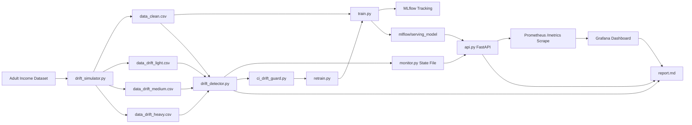

# MLOps Drift Detection Comparison

End-to-end MLOps project for comparing drift detectors on the Adult Income dataset.

The pipeline includes:

- baseline model training and MLflow tracking
- synthetic drift generation for clean, light, medium, and heavy drift
- drift detector benchmarking with KS, PSI, and Jensen-Shannon
- FastAPI model serving and Prometheus metrics export
- Grafana dashboards for drift and performance monitoring
- GitHub Actions drift checks with retraining triggers

## Overview

This project answers a practical question: which drift detector reacts earliest, which one is more conservative, and how can drift be connected to monitoring and retraining in a reproducible MLOps workflow?

It uses the UCI Adult Income dataset to build a small but complete system:

1. Generate clean and drifted datasets.
2. Train a baseline Random Forest model.
3. Compare KS, PSI, and JS detectors.
4. Store monitoring state for the API and dashboard.
5. Serve predictions with FastAPI.
6. Export metrics to Prometheus.
7. Visualize the results in Grafana.
8. Trigger retraining in CI when drift is detected.

## Architecture Diagram



## Project Structure

```text
.
├── data/
│   ├── adult.csv
│   ├── data_clean.csv
│   ├── data_drift_light.csv
│   ├── data_drift_medium.csv
│   └── data_drift_heavy.csv
├── src/
│   ├── api.py
│   ├── ci_drift_guard.py
│   ├── drift_detector.py
│   ├── drift_simulator.py
│   ├── monitor.py
│   ├── retrain.py
│   └── train.py
├── docker/
│   ├── Dockerfile
│   └── docker-compose.yml
├── grafana/
│   ├── dashboards/
│   └── provisioning/
├── mlflow/
│   ├── mlruns/
│   ├── monitoring/
│   └── serving_model/
├── prometheus/
│   └── prometheus.yml
├── tests/
├── report.md
├── requirements.txt
└── README.md
```

## Prerequisites

You need:

- Python 3.11 or newer
- pip and virtual environment support
- Docker and Docker Compose

Helpful tools:

- curl
- jq

## Quick Start

From the project root:

```bash
cd /home/ahsan/Videos/mlops/project

python3 -m venv .venv
source .venv/bin/activate

pip install --upgrade pip
pip install -r requirements.txt
```

Generate the synthetic datasets:

```bash
python src/drift_simulator.py
```

Train the baseline model and log metrics to MLflow:

```bash
python src/train.py
```

Run the full drift comparison:

```bash
python src/drift_detector.py
```

Run the tests:

```bash
pytest tests -q
```

## Run The API

The FastAPI service loads the saved MLflow model and exposes health, prediction, and metrics endpoints.

```bash
uvicorn src.api:app --host 0.0.0.0 --port 8000
```

Endpoints:

- `GET /health`
- `POST /predict`
- `GET /metrics`

Example prediction request:

```bash
curl -X POST "http://localhost:8000/predict" \
  -H "Content-Type: application/json" \
  -d '[
    {
      "age": 39,
      "workclass": "Private",
      "fnlwgt": 77516,
      "education": "Bachelors",
      "educational-num": 13,
      "marital-status": "Never-married",
      "occupation": "Adm-clerical",
      "relationship": "Not-in-family",
      "race": "White",
      "gender": "Male",
      "capital-gain": 2174,
      "capital-loss": 0,
      "hours-per-week": 40,
      "native-country": "United-States"
    }
  ]'
```

## Run The Full Observability Stack

The Docker Compose file starts the API, Prometheus, and Grafana together.

```bash
docker compose -f docker/docker-compose.yml up -d --build
```

Services:

- API: http://localhost:8000
- Prometheus: http://localhost:9090
- Grafana: http://localhost:3000

Grafana login:

- username: `admin`
- password: `admin`

Stop the stack:

```bash
docker compose -f docker/docker-compose.yml down
```

## MLflow Tracking

MLflow stores experiment runs in `mlflow/mlruns`.

Start the MLflow UI locally:

```bash
mlflow ui --backend-store-uri mlflow/mlruns --host 0.0.0.0 --port 5000
```

Open:

- http://localhost:5000

Tracked experiments include:

- `adult_income_baseline`
- `adult_income_drift_detection`
- `adult_income_ci_drift_guard`
- `adult_income_retraining`

## Grafana Dashboard

The Grafana dashboard is provisioned automatically and includes:

- drift score over time
- accuracy degradation curve
- detector comparison panel
- alert timeline

Prometheus scrapes the API every 15 seconds using [prometheus/prometheus.yml](prometheus/prometheus.yml).

## CI/CD Drift Flow

The GitHub Actions workflow in [.github/workflows/ci_cd.yml](.github/workflows/ci_cd.yml) runs:

1. unit tests
2. Docker image build
3. drift guard checks
4. retraining when drift is detected

When drift is found, the pipeline can:

- trigger retraining
- log the retraining run to MLflow
- update monitoring state
- record retraining trigger timing

## Detector Behavior

The project compares three detectors:

- KS: most sensitive in this setup
- PSI: most conservative in this setup
- JS: balanced between the two

Observed results from `python src/drift_detector.py`:

| Detector | Clean | Light | Medium | Heavy | Behavior |
| --- | ---: | ---: | ---: | ---: | --- |
| KS | 0.0000 | 0.0401 | 0.1128 | 0.2922 | Detects light, medium, and heavy drift |
| PSI | 0.0000 | 0.0005 | 0.0330 | 0.3215 | Detects heavy drift only |
| JS | 0.0000 | 0.0182 | 0.1300 | 0.2737 | Detects medium and heavy drift |

## Monitoring State

The runtime state used by the API and dashboard is stored in `mlflow/monitoring/state.json`.

It contains:

- latest accuracy
- drift scores per detector
- drift detection flags
- alert count
- detector execution time
- retraining trigger time

The CI drift report is written to `mlflow/monitoring/ci_drift_report.json`.

## Recommended Run Order

If you are starting from scratch, run the project in this order:

1. `python src/drift_simulator.py`
2. `python src/train.py`
3. `python src/drift_detector.py`
4. `uvicorn src.api:app --host 0.0.0.0 --port 8000`
5. `docker compose -f docker/docker-compose.yml up -d --build`
6. `mlflow ui --backend-store-uri mlflow/mlruns --host 0.0.0.0 --port 5000`

## Notes

- If `/predict` fails, run training again so `mlflow/serving_model` exists.
- Prometheus must be able to reach the API service on port 8000.
- Grafana reads its datasource and dashboard provisioning from the `grafana/` folder.
- A full report for this project is available in [report.md](report.md).

